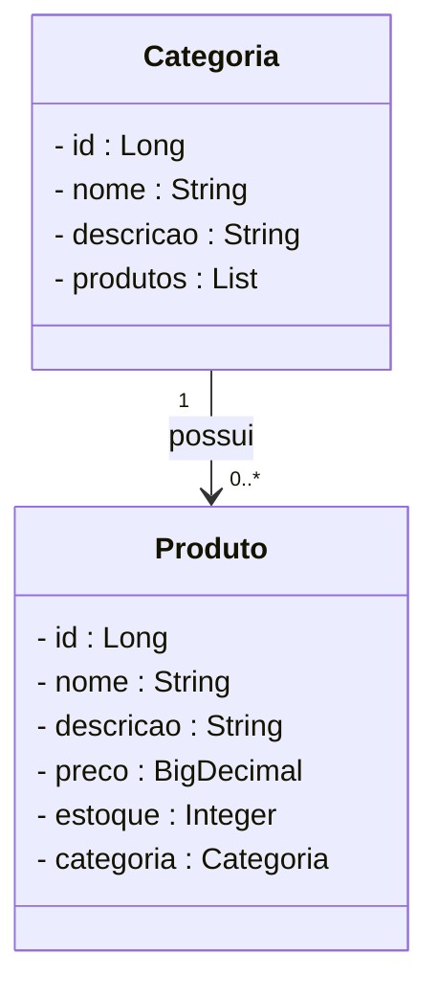
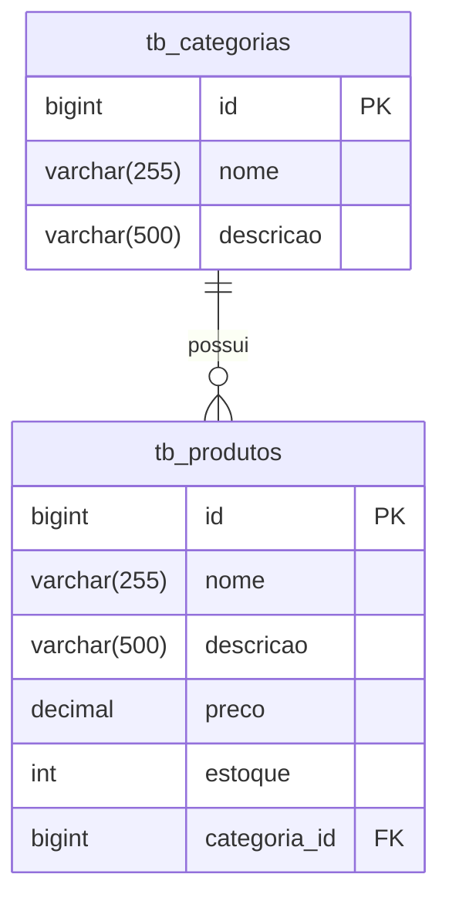

# Projeto Loja de Games - Backend com Spring Boot

<br />

<div align="center">
     
</div>

<br />

<div align="center">
  
  
  
  
  
  
  
</div>

<br />

## 1. Descrição

O projeto **Loja de Games** é uma API REST desenvolvida em Java com Spring Boot, que permite o gerenciamento de produtos e categorias de uma loja de jogos. O objetivo é possibilitar a criação, leitura, atualização e remoção de produtos e categorias, além de testar e praticar conceitos de desenvolvimento de APIs RESTful.

## 2. Sobre esta API

A API foi desenvolvida utilizando **Java** e o **framework Spring**, seguindo os princípios da Arquitetura MVC e REST. Ela oferece endpoints para o gerenciamento dos recursos **Categoria** e **Produto**, que estão relacionados entre si.

### 2.1. Funcionalidades:

1. CRUD completo de Categorias
2. CRUD completo de Produtos
3. Relacionamento entre Produtos e Categorias (One to Many)
4. Busca por nome de Produto e Categoria
5. Validações e tratamento de erros

## 3. Diagrama de Classes



## 4. Diagrama Entidade-Relacionamento (DER)



## 5. Tecnologias utilizadas

| Item                          | Descrição       |
| ----------------------------- | --------------- |
| **Servidor**                  | Tomcat          |
| **Linguagem de programação**  | Java            |
| **Framework**                 | Spring Boot     |
| **ORM**                       | JPA + Hibernate |
| **Banco de dados Relacional** | MySQL           |
| **Documentação**              | SpringDoc OpenAPI|
| **Testes de API**             | Insomnia        |

## 6. Requisitos

Para executar o projeto localmente, você precisará de:

- [Java JDK 17+](https://www.oracle.com/java/technologies/javase/jdk17-archive-downloads.html)
- Banco de dados [MySQL](https://dev.mysql.com/downloads/)
- [STS](https://spring.io/tools) ou [IntelliJ IDEA](https://www.jetbrains.com/idea/)
- [Insomnia](https://insomnia.rest/download) ou [Postman](https://www.postman.com/)

## 7. Como Executar o projeto no STS

### 7.1. Importando o Projeto

1. Clone o repositório do Projeto Loja de Games:

```bash
git clone https://github.com/feperonica/lojagames_spring.git
```

2. Abra o STS e importe como projeto existente no workspace.

### 7.2. Executando o projeto

1. Na Guia **Boot Dashboard**, localize o **Projeto Loja de Games**
2. Clique no botão **Start ou Restart**
3. Verifique no console se a conexão com o banco foi feita corretamente.
4. Use o Insomnia ou Postman para testar os endpoints.

## 8. Contribuição

Este projeto faz parte de um exercício educacional, mas sugestões de melhorias, correções ou contribuições são bem-vindas. Fique à vontade para:

- Abrir uma **issue**
- Enviar um **pull request**
- Compartilhar com colegas que estejam aprendendo Spring Boot!

## 9. Contato

Desenvolvido por [**Felipe Peronica**](https://github.com/feperonica)  
📧 felipeperonica@gmail.com
